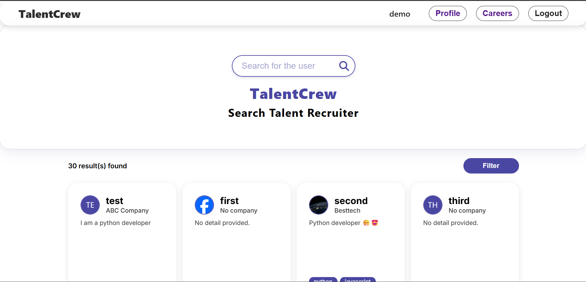
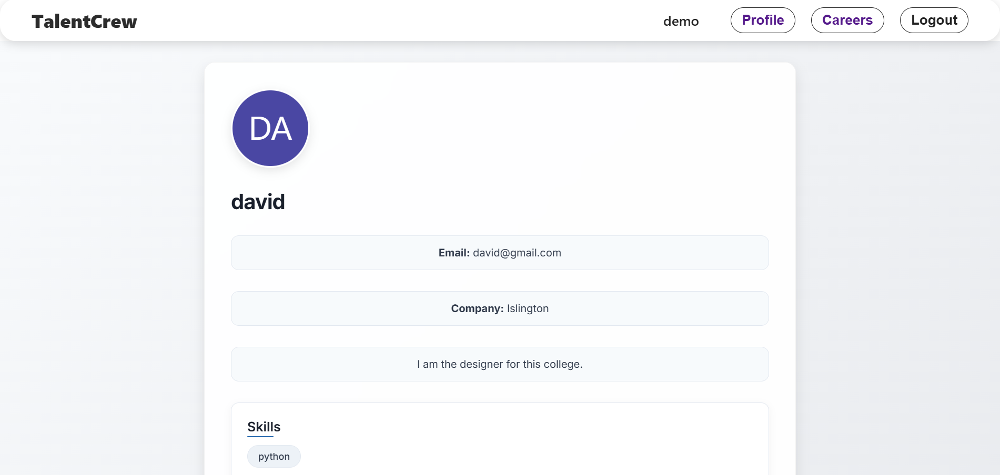

# Summer Class Project — TalentCrew 🚀

**Live Demo:** [https://summer-class-proj.onrender.com](https://summer-class-proj.onrender.com)  
**GitHub Repo:** [https://github.com/Nabinbista12/Summer-class](https://github.com/Nabinbista12/Summer-class)  

---

## 📖 Short Description

TalentCrew is a project I built during my **Summer Class** at college 🎓.  
The goal of this project was to create a platform where people can find talent based on **skills, college, or names**.  
Whether you’re looking to hire, collaborate, or just explore talent, TalentCrew makes it easier for users to discover the right people.

This project helped me **learn full-stack development**, including React, Node.js, MongoDB, and integrating third-party services like Cloudinary.  

---

## 🔗 Quick Links

- **Live Demo:** [https://summer-class-proj.onrender.com](https://summer-class-proj.onrender.com) 🌐  
- **GitHub Repo:** [https://github.com/Nabinbista12/Summer-class](https://github.com/Nabinbista12/Summer-class) 📦  

---

## 💻 Features

- **Full-stack MERN app** (MongoDB, Express, React, Node.js).  
- **Dynamic Search Functionality**:
  - **Skills**: Enter multiple skills, each creates a badge. Internships/profiles are **ranked by number of matching skills**.  
  - **College**: Filter results by college name.  
  - **Name**: Search by the person’s name.  
- **Profile management**: Users can create and edit profiles, add skills and experience.  
- **Responsive design**: Works on desktop and mobile.  
- **Image uploads** using Cloudinary.  

---

## 🖼️ Screenshots / Demo

### Home page


### Profile Page


### Skill Badge
  


---

## ⚙️ Local Development

To run the project locally:

```powershell
cd backend
npm install
npm run dev

cd ../frontend
npm install
npm run dev
````

**Notes:**

* Ensure MongoDB is running locally.
* Configure environment variables in `backend/.env`:
PORT=
MONGO_URL=
JWT_SECRET=
CLOUDINARY_CLOUD_NAME=
CLOUDINARY_API_KEY=
CLOUDINARY_API_SECRET=

* Frontend API is centralized in `frontend/src/config/URLAPI.ts`. Set `mode` to `'development'` or `'production'`.
* Backend API is centralized in `backend/config/URLAPI.js`. Set `mode` to `'development'` or `'production'`, or update the allowed CORS origin in `app.js` directly.


---

## 🛠️ Tools & Libraries Used

* **Backend:** Node.js, Express, MongoDB & Mongoose, Cloudinary
* **Frontend:** React, TypeScript, Vite, Axios, react-router, react-hook-form, react-toastify
* **UI:** Font Awesome (icons), responsive design with CSS

---

## 🌱 What I Learned

During the Summer Class, I learned:

* How to structure a **full-stack project** and connect frontend & backend efficiently.
* Handling **file uploads** and integrating third-party services.
* Implementing **dynamic search and filtering** based on multiple parameters (skills, college, names).
* Building **interactive UI components** like skill badges and full-width cards.
* Understanding **user experience** for search and filtering functionality.

---

## 🚀 Future Plans

I plan to continue improving TalentCrew:

* Add **hackathon/project participation pages** to showcase achievements.
* Implement **advanced search & ranking** for more accurate matches.
* Add **real-time chat** and messaging features.
* Improve the **UI/UX design** to make it more engaging.
* Add **notifications and email integration** for updates on new profiles.

---

## 🔎 Why TalentCrew?

TalentCrew is designed to make **finding talent easy and intuitive**.

* Users can **search people based on their skills, college, or name**.
* Multiple skill search shows the **most relevant matches first**.
* Ideal for **collaborations, internships, hackathons, or recruitment**.
* Helps **connect students with each other and with professionals** in a meaningful way.

---

## 🎯 Contact

* **Developer:** Nabin Bista
* **GitHub:** [https://github.com/Nabinbista12](https://github.com/Nabinbista12)
* **Portfolio / LinkedIn:** https://www.nabinbista.me

---

> Made with ❤️ during my Summer Class. TalentCrew is a stepping stone for my future projects where I plan to integrate hackathons, collaborative projects, and more advanced talent search functionality.

```
